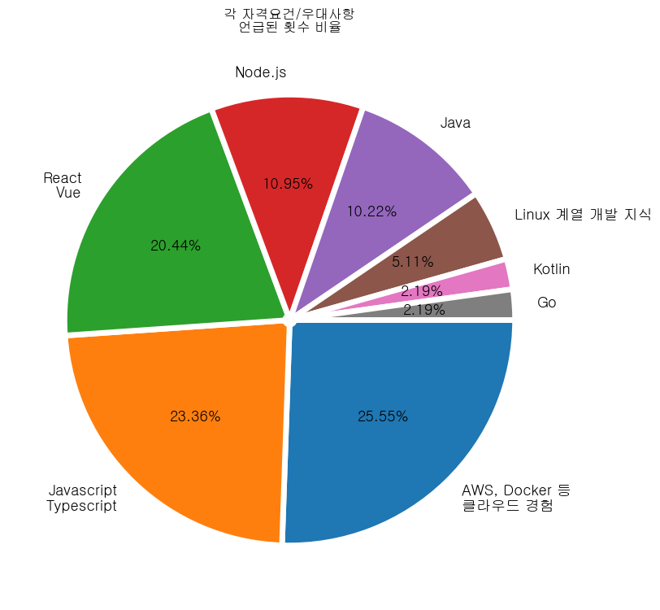

###### 수시로 문서 갱신중입니다.  

---

# 목차   

   

   

   

1. [선택한 개발 직군의 종류](#1-선택한-개발-직군의-종류)   

   

2. [정보를 찾은 사이트 ](#2-정보를-찾은-사이트)  

   

3. [공통 자격요건 및 우대사항](#3-공통-자격요건-및-우대사항)   

   

4. [총평 ](#4-총평)  

   

   

   

# 1. 선택한 개발 직군의 종류   

   

   

   

- 프론트엔드   

   

- 백엔드   

   

---

###### 아래의 태그를 기준으로 검색하였습니다.   

---

   

- 지역 : 서울   

   

- 경력 : 신입   

   

- 연봉 : 무관   

   

- 보유 기술스택 :    

  

     

   

   

[목차로 가기](#목차)

# 2. 정보를 찾은 사이트   

   

   

   

- 글자를 누르면 해당 문서 페이지로 이동합니다.   

   

- [원티드](#원티드-공고) : https://www.wanted.co.kr/
- [로켓펀치](#로켓펀치-공고) : https://www.rocketpunch.com/
- [점핏](#점핏-공고) : https://www.jumpit.co.kr/
- [자소설닷컴](#자소설닷컴-공고) : https://jasoseol.com/
- [사람인](#사람인-공고) : https://www.saramin.co.kr
- [잡코리아](#잡코리아-공고) : https://www.jobkorea.co.kr

   

   

   

---

   

   

[목차로 가기](#목차)

### 원티드 공고   

   

- 프론트엔드   

     

  1. [마인딩](https://www.wanted.co.kr/company/25125)
  
  2. [레드빅](https://www.wanted.co.kr/company/11680)
  
  3. [플피](https://www.wanted.co.kr/company/28660)
  
  4. [헬프미](https://www.wanted.co.kr/company/286)
  
  5. [이노핀](https://www.wanted.co.kr/company/25314)  
  
        
  
  6. [메타지](https://www.wanted.co.kr/company/29615)
  
  7. [세샤트](https://www.wanted.co.kr/company/16643)
  
  8. [수성엔지니어링](https://www.wanted.co.kr/company/11515)
  
  9. [에르사츠](https://www.wanted.co.kr/company/23381)
  
  10. [어크로스비](https://www.wanted.co.kr/company/28603)   

     

- 백엔드   

     

  1. [에너자이(ENERZAi)](https://www.wanted.co.kr/company/12846)
  
  2. [헬프미](https://www.wanted.co.kr/company/286)
  
  3. [이노핀](https://www.wanted.co.kr/company/25314)
  
  4. [어크로스비](https://www.wanted.co.kr/company/28603)
  
  5. [시루정보](https://www.wanted.co.kr/company/5818)   
  
        
  
  6. [퍼즐벤처스(PuzzlesVenturesCo.)](https://www.wanted.co.kr/company/15146)
  
  7. [비하베스트](https://www.wanted.co.kr/company/20956)
  
  8. [메타지](https://www.wanted.co.kr/company/29615)
  
  9. [이팝콘](https://www.wanted.co.kr/company/33034)
  
  10. [양재미디어](https://www.wanted.co.kr/company/9092)   

     

- 평가 및 특이사항   

     

  - 타 사이트들과 다르게 기술스택이 아닌 개발직무(주언어) 태그에 파이썬 개발자가 있었다.
  - 주로 알고리즘, 신호처리, 인공지능, 수치해석과 같은 연구직 일자리가 많았다.
  - 석, 박사 학위의 전공자가 아니라면 준비에 상당한 노력이 필요할 듯 보인다.  

     

     

[목차로 가기](#목차)

### 로켓펀치 공고   

   

- 프론트엔드   

     

  1. [컨셉터스](https://www.rocketpunch.com/jobs/130489/%EB%B9%85%EB%8D%B0%EC%9D%B4%ED%84%B0-%EC%9D%B8%ED%94%8C%EB%A3%A8%EC%96%B8%EC%84%9C-%EC%BB%A4%EB%A8%B8%EC%8A%A4-%ED%94%8C%EB%9E%AB%ED%8F%BC-%EC%9B%B9Front-end%ED%94%84%EB%A1%A0%ED%8A%B8%EC%97%94%EB%93%9C-%EC%8B%A0%EC%9E%85%EA%B2%BD%EB%A0%A5%EC%A7%81-%EC%B1%84%EC%9A%A9)

  2. [디티솔루션](https://www.rocketpunch.com/jobs/130342/%EA%B0%9C%EB%B0%9C%EC%9E%90)

  3. [오픈갤러리](https://www.rocketpunch.com/jobs/115428/Django-%ED%92%80-%EC%8A%A4%ED%83%9D-%EA%B0%9C%EB%B0%9C%EC%9E%90-%EC%9D%BC%EB%B0%98-%EA%B0%9C%EB%B0%9C%EC%9E%90-%EC%82%B0%EC%97%85%EA%B8%B0%EB%8A%A5%EC%9A%94%EC%9B%90-%EC%A0%84%EC%A7%81-%EB%B3%B4%EC%B6%A9%EC%97%AD-%ED%8E%B8%EC%9E%85)

  4. [이노플](https://www.rocketpunch.com/jobs/119456/Front-end-React-%EA%B0%9C%EB%B0%9C-%EC%86%8C%ED%94%84%ED%8A%B8%EC%9B%A8%EC%96%B4%EC%9D%98-%EC%8B%AC%EC%9E%A5-%EA%B0%9C%EB%B0%9C%EC%9E%90%EB%A5%BC-%EB%AA%A8%EC%8B%AD%EB%8B%88%EB%8B%A4)

  5. [펫트너](https://www.rocketpunch.com/jobs/130427/%ED%94%84%EB%A1%A0%ED%8A%B8%EC%97%94%EB%93%9C-%EA%B0%9C%EB%B0%9C%EC%9E%90)   

        

  6. [아이딕스랩](https://www.rocketpunch.com/jobs/124677/%EC%9B%B9%EC%84%9C%EB%B9%84%EC%8A%A4-%EA%B0%9C%EB%B0%9C%EC%9E%90%ED%94%84%EB%A1%A0%ED%8A%B8%EC%95%A4%EB%93%9C%EB%B0%B1%EC%95%A4%EB%93%9C-%EB%AA%A8%EC%8B%AD%EB%8B%88%EB%8B%A4)

  7. [심바이오트에이아이](https://www.rocketpunch.com/jobs/115719/Full-Stack-Engineer-%EC%86%8C%ED%94%84%ED%8A%B8%EC%9B%A8%EC%96%B4-%EC%97%94%EC%A7%80%EB%8B%88%EC%96%B4)

  8. [이도플래닝](https://www.rocketpunch.com/jobs/129589/%ED%94%84%EB%A1%A0%ED%8A%B8-%EA%B0%9C%EB%B0%9C%EC%9E%90-%ED%94%84%EB%A1%9C%EB%AA%A8%EC%85%98-%EA%B8%B0%ED%9A%8D%EC%9E%90-%EB%AA%A8%EC%A7%91)

  9. [체인랩스아이티](https://www.rocketpunch.com/jobs/116007/%ED%92%80%EC%8A%A4%ED%83%9D-%EA%B0%9C%EB%B0%9C%EC%9E%90)

  10. [데브스택](https://www.rocketpunch.com/jobs/119543/%ED%92%80%EC%8A%A4%ED%83%9D-%EA%B0%9C%EB%B0%9C%EC%9E%90-%EC%B1%84%EC%9A%A9%EC%A0%84%EB%AC%B8%EC%97%B0%EA%B5%AC%EC%9A%94%EC%9B%90-%ED%8F%AC%ED%95%A8)   

     

- 백엔드   

     

  1. [더커머스](https://www.rocketpunch.com/jobs/128825/%EB%8D%94%EC%BB%A4%EB%A8%B8%EC%8A%A4%EB%B0%B1%EC%97%94%EB%93%9C-%EA%B0%9C%EB%B0%9C%EC%9E%90-%EC%8B%A0%EC%9E%85%EA%B2%BD%EB%A0%A5-%EC%B1%84%EC%9A%A9-%EC%82%AC%EC%84%B8%ED%99%95%EC%9E%A5)
  
  2. [아테나스랩](https://www.rocketpunch.com/jobs/127997/%EC%84%9C%EB%B2%84-%EA%B0%9C%EB%B0%9C%EC%9E%90-PythonDjango-Developer-%EC%B1%84%EC%9A%A9-%EC%A3%BC%EB%8B%88%EC%96%B4)
  
  3. [리브햇](https://www.rocketpunch.com/jobs/88132/%EC%97%AC%ED%96%89%EC%9D%B4-%EB%9C%AC%EB%8B%A4-%EC%97%AC%ED%96%89%EC%9D%98-%EC%A6%90%EA%B1%B0%EC%9B%80%EA%B3%BC-%EC%84%A4%EB%A0%98%EC%9D%84-%EC%95%84%EC%8B%9C%EB%8A%94-%EB%B0%B1%EC%97%94%EB%93%9C-%EA%B0%9C%EB%B0%9C%EC%9E%90%EB%8B%98%EC%9D%84-%EC%B0%BE%EC%8A%B5%EB%8B%88%EB%8B%A4-PythonDjango%EC%97%AC%ED%96%89-B2CB2B-%ED%94%8C%EB%9E%AB%ED%8F%BC-%EA%B5%AC%EC%B6%95%EA%B0%9C%EB%B0%9C-%ED%94%84%EB%A1%9C%EC%A0%9D%ED%8A%B8)
  
  4. [디티솔루션](https://www.rocketpunch.com/jobs/130342/%EA%B0%9C%EB%B0%9C%EC%9E%90)
  
  5. [오픈갤러리](https://www.rocketpunch.com/jobs/115428/Django-%ED%92%80-%EC%8A%A4%ED%83%9D-%EA%B0%9C%EB%B0%9C%EC%9E%90-%EC%9D%BC%EB%B0%98-%EA%B0%9C%EB%B0%9C%EC%9E%90-%EC%82%B0%EC%97%85%EA%B8%B0%EB%8A%A5%EC%9A%94%EC%9B%90-%EC%A0%84%EC%A7%81-%EB%B3%B4%EC%B6%A9%EC%97%AD-%ED%8E%B8%EC%9E%85)   
  
        
  
  6. [이노플](https://www.rocketpunch.com/jobs/125032/Back-end-Django-Nodejs-%EA%B0%9C%EB%B0%9C-%EC%84%9C%EB%B2%84-%EA%B0%9C%EB%B0%9C%EC%9E%90-%EB%AA%A8%EC%A7%91)
  
  7. [트릿지](https://www.rocketpunch.com/jobs/128870/Junior-Backend-Engineer-%EC%8B%A4%EB%AC%B4-%EA%B2%BD%ED%97%98%EC%9E%90-%EB%B0%8F-%EC%98%81%EC%96%B4%EA%B0%80%EB%8A%A5%EC%9E%90-%EC%9A%B0%EB%8C%80)
  
  8. [엘리스](https://www.rocketpunch.com/jobs/117434/%EC%8B%A0%EC%9E%85-%EB%B0%B1%EC%97%94%EB%93%9C-%EA%B0%9C%EB%B0%9C%EC%9E%90)
  
  9. [AB180](https://www.rocketpunch.com/jobs/123664/Junior-Backend-Engineer%EC%A3%BC%EB%8B%88%EC%96%B4-%EB%B0%B1%EC%97%94%EB%93%9C-%EC%97%94%EC%A7%80%EB%8B%88%EC%96%B4)
  
  10. [알고리고](https://www.rocketpunch.com/jobs/126862/%EC%95%8C%EA%B3%A0%EB%A6%AC%EA%B3%A0%EC%97%90%EC%84%9C-%EB%B0%B1%EC%97%94%EB%93%9C-%EA%B0%9C%EB%B0%9C%EC%9E%90%EB%A5%BC-%EB%AA%A8%EC%8B%AD%EB%8B%88%EB%8B%A4)   

     

     

[목차로 가기](#목차)

### 점핏 공고   

   

- 프론트엔드   

     

  1. [커먼옥션](https://www.jumpit.co.kr/position/10567)

  2. [백패커](https://www.jumpit.co.kr/company/82)

  3. [GC케어](https://www.jumpit.co.kr/company/818)

  4. [트리플나인홀딩스](https://www.jumpit.co.kr/company/3216)

  5. [클로마운트](https://www.jumpit.co.kr/company/1103)   

        

  6. [인비전랩](https://www.jumpit.co.kr/company/3770)

  7. [배움](https://www.jumpit.co.kr/company/3691)

  8. [도구공간](https://www.jumpit.co.kr/company/1765)

  9. [위메프](https://www.jumpit.co.kr/company/201)
  
  10. [뉴지스탁 ](https://www.jumpit.co.kr/company/952)  

   

- 백엔드   

     

  1. [미디움](https://www.jumpit.co.kr/position/10428)

  2. [한국축산데이터](https://www.jumpit.co.kr/position/6243)

  3. [코코넛](https://www.jumpit.co.kr/position/9383)

  4. [페이게이트](https://www.jumpit.co.kr/company/3796)

  5. [버즈니 ](https://www.jumpit.co.kr/company/181)  

        

  6. [페이타랩](https://www.jumpit.co.kr/company/385)

  7. [골든플래닛](https://www.jumpit.co.kr/company/737)

  8. [게임듀오](https://www.jumpit.co.kr/company/2584)

  9. [메타로고스](https://www.jumpit.co.kr/company/3768)
  
  10. [빌드블록](https://www.jumpit.co.kr/company/2744)   

     

     

[목차로 가기](#목차)

### 자소설닷컴 공고   

   

- 프론트엔드 / 백엔드 통합 (개발환경, 언어 필터링 안됨)   

     

  1. [더존비즈온](https://jasoseol.com/recruit/65122)

  2. [한국네트웍스](https://jasoseol.com/recruit/65061)

  3. [금호타이어](https://jasoseol.com/recruit/65125)

  4. [넥슨코리아](https://jasoseol.com/recruit/65117)

  5. [환인제약](https://jasoseol.com/recruit/65265)   

        

  6. [한국품질제단](https://jasoseol.com/recruit/65243)

  7. [어플라이드 머티어리얼즈 코리아](https://jasoseol.com/recruit/65166)

  8. [에이피알](https://jasoseol.com/recruit/65333)

  9. [일화](https://jasoseol.com/recruit/65433)

  10. [경기창조경제혁신센터](https://jasoseol.com/recruit/65445)   

         

  11. [일동이커머스](https://jasoseol.com/recruit/65426)

  12. [패스트파이브](https://jasoseol.com/recruit/65595)

  13. [두산로지스틱스솔루션](https://jasoseol.com/recruit/65617)

  14. [BNK시스템](https://jasoseol.com/recruit/65714)

  15. [신원](https://jasoseol.com/recruit/65646)   

         

  16. [한국물가협회](https://jasoseol.com/recruit/65657)

  17. [더블유게임즈](https://jasoseol.com/recruit/65758)

  18. [창성](https://jasoseol.com/recruit/65775)

  19. [카카오엔터프라이즈](https://jasoseol.com/recruit/65733)

  20. [한국마사회](https://jasoseol.com/recruit/65763)   

     

     

[목차로 가기](#목차)

### 사람인 공고   

   

- 프론트엔드 / 백엔드 통합 (개발환경, 언어 필터링 안됨)   

     

  1. [(주)엘아이지시스템](https://www.saramin.co.kr/zf_user/company-info/view?csn=b2ljbU5CL3JUdy9iY1Urelc2ZmhyUT09&popup_yn=y)

  2. [(주)토마토시스템](https://www.saramin.co.kr/zf_user/company-info/view?csn=bVJoNWh6VWJIQkh1aE1IZ3h1R1Rldz09&popup_yn=y)

  3. [리치톡](https://www.saramin.co.kr/zf_user/company-info/view?csn=a3htZGpOaTBDWVpPMHlHcmlYL1hydz09&popup_yn=y)

  4. [지쿱(주)](https://www.saramin.co.kr/zf_user/company-info/view?csn=eWNsV1VENjJLazVWYlF5NURpajA1QT09&popup_yn=y)

  5. [(주)콰가](https://www.saramin.co.kr/zf_user/company-info/view?csn=dHVlSUNXRmpCQUh2VU0xdFJLOFdlZz09&popup_yn=y)   

        

  6. [(주)씨씨미디어서비스](https://www.saramin.co.kr/zf_user/company-info/view?csn=U1RPZmFyQjFXNmE4TEh3bnZEK1pMQT09&popup_yn=y)

  7. [(주)그린위치](https://www.saramin.co.kr/zf_user/company-info/view?csn=ejU5bXdRbUc5eGE5OWpnUnhRNTV1QT09&popup_yn=y)

  8. [(주)인크로스](https://www.saramin.co.kr/zf_user/company-info/view?csn=eE5UeVhobUh6NXcwTHduMm1CTy85Zz09&popup_yn=y)

  9. [(주)옥션원](https://www.saramin.co.kr/zf_user/company-info/view?csn=WDRmbmdONE9KODNMR3JjVFpLU2c3dz09&popup_yn=y)

  10. [(주)뉴링크](https://www.saramin.co.kr/zf_user/company-info/view?csn=U1ZueXI0aFBhNGZieXpqNXNiVnp4QT09&popup_yn=y)   

         

  11. [(주)에스브이](https://www.saramin.co.kr/zf_user/company-info/view?csn=L3lkQXVrcWFPK3NBV1ZaVWdOcWpNdz09&popup_yn=y)

  12. [(주)디에이치로지스틱스](https://www.saramin.co.kr/zf_user/company-info/view?csn=WjYrZndsOUdibFhxc1FrVS9PYTZnUT09&popup_yn=y)

  13. [(주)인피니소프트](https://www.saramin.co.kr/zf_user/company-info/view?csn=eU5mY3VGc0tCT0pjVk11dkxJQ2ZSdz09&popup_yn=y)

  14. [(주)케이지이니시스](https://www.saramin.co.kr/zf_user/company-info/view?csn=cFNLWlMrWHQyQ0laQTEvbjJodjNsUT09&popup_yn=y)

  15. [(주)대교씨엔에스](https://www.saramin.co.kr/zf_user/company-info/view?csn=NGJzdXBtTkhWQkRwbE5SKzY5dTRRQT09&popup_yn=y)   

         

  16. 이제너두(주) (기업소개 바로가기링크 없음)

  17. [(주)앤트썸](https://www.saramin.co.kr/zf_user/company-info/view?csn=Y2VsOXEwc0drR2d1bTdVRDAydlZRdz09&popup_yn=y)

  18. [(주)키다리스튜디오](https://www.saramin.co.kr/zf_user/company-info/view?csn=amhwVm1sbHZkREhqY2JGdHprL0Ewdz09&popup_yn=y)

  19. [한화손해보험(주)](https://www.saramin.co.kr/zf_user/company-info/view?csn=RHB1eTczNStKTENueTUwYlVhNzhLZz09&popup_yn=y)

  20. [SK텔레콤(주)](https://www.saramin.co.kr/zf_user/company-info/view?csn=ckxLKzZwTlBnZTFleFRSUTJQR3ZRZz09&popup_yn=y)   

     

     

[목차로 가기](#목차)

### 잡코리아 공고   

   

- 프론트엔드 / 백엔드 통합  (개발환경 필터링 안됨, 언어 Python)   

     

  1. [오스템임플란트](https://www.jobkorea.co.kr/Recruit/GI_Read/38985570?rPageCode=SL)

  2. [더존비즈온](https://www.jobkorea.co.kr/Recruit/GI_Read/38842425?rPageCode=SL)

  3. [이카운트](https://www.jobkorea.co.kr/Recruit/GI_Read/38856209?rPageCode=SL)

  4. [엘림넷](https://www.jobkorea.co.kr/Recruit/GI_Read/38978834?rPageCode=SL)

  5. [모나미](https://www.jobkorea.co.kr/Recruit/GI_Read/38984669?rPageCode=SL)   

        

  6. [도미노피자(청오디피케이, 자회사)](https://www.jobkorea.co.kr/Recruit/GI_Read/38900101?rPageCode=SL)

  7. [삼성메디슨](https://www.jobkorea.co.kr/Recruit/GI_Read/38853112?rPageCode=SL)

  8. [통로이미지](https://www.jobkorea.co.kr/Recruit/GI_Read/38889619?rPageCode=SL)

  9. [요기요(위대한상상)](https://www.jobkorea.co.kr/Recruit/GI_Read/38944447?rPageCode=SL)

  10. [레진엔터테인먼트](https://www.jobkorea.co.kr/Recruit/GI_Read/38893970?rPageCode=SL)   

         

  11. [한국정보보호산업협회](https://www.jobkorea.co.kr/Recruit/GI_Read/38873057?rPageCode=SL)

  12. [KB데이타시스템](https://www.jobkorea.co.kr/Recruit/GI_Read/38835934?rPageCode=SL)

  13. [잉카엔트웍스](https://www.jobkorea.co.kr/Recruit/GI_Read/38899609?rPageCode=SL)

  14. [에스아이티](https://www.jobkorea.co.kr/Recruit/GI_Read/38945677?rPageCode=SL)

  15. [겟앤쇼](https://www.jobkorea.co.kr/Recruit/GI_Read/38766782?rPageCode=SL)   

         

  16. [더이앤엠](https://www.jobkorea.co.kr/Recruit/GI_Read/38960490?rPageCode=SL)

  17. [지아이티](https://www.jobkorea.co.kr/Recruit/GI_Read/38977589?rPageCode=SL)

  18. [앤씨앤](https://www.jobkorea.co.kr/Recruit/GI_Read/38900059?rPageCode=SL)

  19. [인사이드정보](https://www.jobkorea.co.kr/Recruit/GI_Read/38896145?rPageCode=SL)

  20. [아이피버스](https://www.jobkorea.co.kr/Recruit/GI_Read/38486005?rPageCode=SL)   

     

     

[목차로 가기](#목차)

# 3. 공통 자격요건 및 우대사항   

   

   

   

- 괄호 안은 해당 자격요건/우대사항이 공고에서 언급된 총 횟수   

   

- 언급 횟수가 적은 언어나 프레임워크는 적어놓지 않았습니다.   

   

   

   

1. AWS, Docker등 클라우드 관련 경험 (35)
2. Javascript/Typescript (32)
3. React/Vue 등 (28)
4. Git/GitHub (19)
5. Node.js (15)
6. Java (14)
7. Linux 계열 개발환경 관련 지식 (7)
8. Kotlin (3), Go (3)   

   

   

   

   

   

[목차로 가기](#목차)

# 4. 총평   

   

- Python 은 프론트, 백, 다양한 연구 등 여러 분야가 있겠지만 백엔드와 데이터 분야에서 많이 쓰인다.
- 언급된 자격요건 중 상위 3 ~ 5 개 까지만 해 놓아도 주니어 개발자로서 취업에는 지장이 없을 것 같다.   

     

     

     

[목차로 가기](#목차)

---

문서 최종 수정일 : 2022 07 08
